## Step 1: Enable Copilot cloud agent

In the [Getting Started with GitHub Copilot](/skills/getting-started-with-github-copilot) exercise, we learned how to use Copilot in our code editor to make major upgrades to the Mergington Extracurricular Activities site. 🎻 ⚽️ ♟️

In fact, the site has become a regular school tool now. And, although you like that attention, you just realized a problem! You are about to go on sabbatical next semester!

After some discussion with the principal, he has accepted that new features will be postponed, but... he is worried. They need to at least have _something_ for handling simple changes while you are away.

Let's set our teachers up for success by enrolling Copilot (in our school) to handle updates while we are away.

<details>
<summary>📸 Website screenshot</summary><br/>

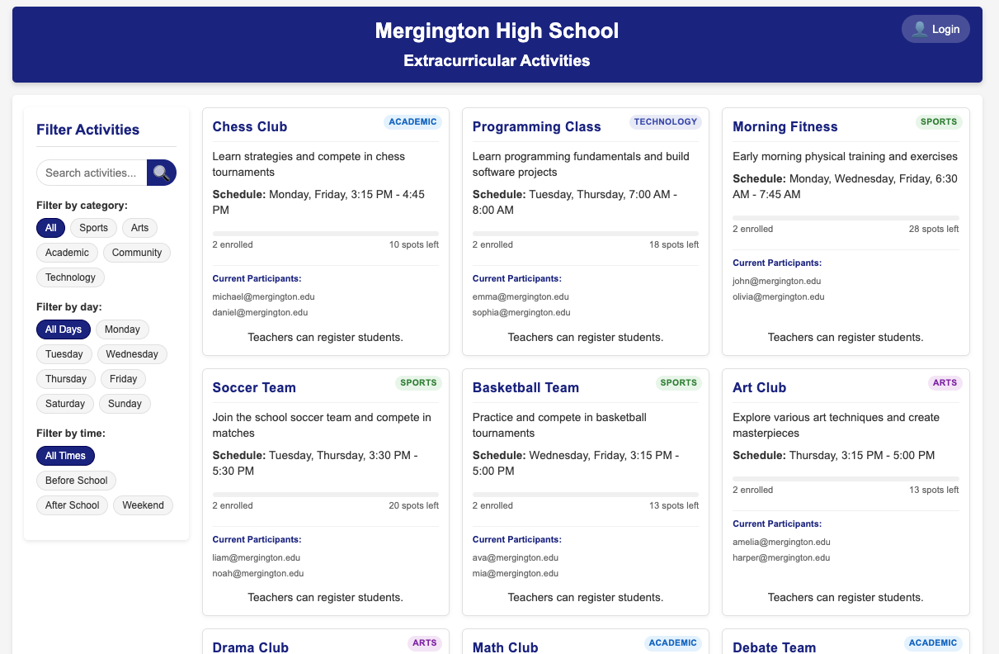

</details>

### 📖 Theory: Copilot is now your cloud agent

In previous exercises, we used Copilot chat in our local the editor with **Plan** and **Agent** mode. While those were super helpful, **Copilot cloud agent** takes this to the next level by operating entirely on GitHub. No code editor required! 😎

| Feature                 | Copilot in the editor | Copilot cloud agent                             |
| ----------------------- | --------------------- | ----------------------------------------------- |
| **Interface**           | Your code editor      | Issues, Pull Requests, Agents Tab, Agents Panel |
| **Work Scope**          | Local files           | Repository                                      |
| **Custom Instructions** | ✅                    | ✅                                              |
| **Custom Agents**       | ✅                    | ✅                                              |
| **Skills**              | ✅                    | ✅                                              |
| **Hooks**               | ✅                    | ✅                                              |
| **MCP Support**         | ✅                    | ✅                                              |
| **Vibe Coding**         | 😎                    | 😎                                              |

### How does it work?

While Copilot cloud agent can be activated in many ways and you can easily flow between them, let's get started with a typical task-tracking approach.

From the contributor perspective, the flow is very similar to an issue + pull request style workflow.

1. A contributor with **write access** selects an issue and assigns it to Copilot (which also assigns it to themselves).
2. Copilot creates a branch, starts a pull request, and works on the changes.
3. Copilot works on the branch in an Actions workflow and provides updates via the pull request conversation tab and session logs.
4. When Copilot finishes the issue, the assigner is requested to review.
5. Assigner submits a review, adds comments, or approves.
6. If feedback is provided, Copilot continues working to implement it.
7. The requester repeats above steps until satisfied and then merges.

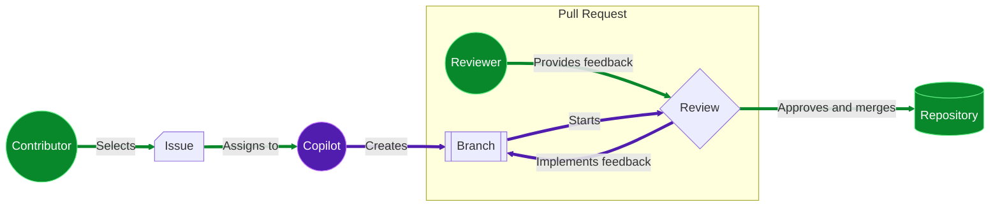

#### Is this safe?

Several security precautions have been implemented to help reduce concerns. Here are a few limitations that you might need to consider when asking Copilot to work on an issue.

- Copilot can only make changes on the branch it created and resources provided by the repository.
- Copilot has [configurable firewall](https://docs.github.com/en/copilot/customizing-copilot/customizing-or-disabling-the-firewall-for-copilot-coding-agent) that restricts access to the internet.
- Only users with write access can assign Copilot an issue.
- Hidden content in issues (like commented code) is ignored.

> [!IMPORTANT]
> The full list of mitigations and configuration settings can be found in the [Responsible use of Copilot cloud agent](https://docs.github.com/en/copilot/responsible-use-of-github-copilot-features/responsible-use-of-copilot-coding-agent-on-githubcom) documentation.

## ⌨️ Activity: (optional) Get to know our extracurricular activities site

> [!NOTE]
> Opening a development environment and running the application is not necessary to complete this exercise. You can skip this activity if desired.

<details>
<summary>Show Steps</summary>

In other exercises, we have been developing the Extracurricular Activities website. You can follow these steps to start up the development environment and try it out.

1. Right-click the below button to open the **Create Codespace** page in a new tab. Use the default configuration.

   [](https://codespaces.new/{{full_repo_name}}?quickstart=1)

1. Wait some time for the environment to be prepared. It will automatically install all requirements and services.

1. Validate the **GitHub Copilot** and **Python** extensions are installed and enabled.

   <br/>
   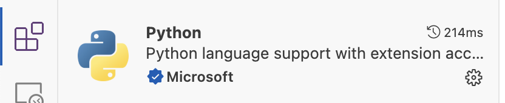

1. Try running the application. In the left sidebar, select the **Run and Debug** tab and then press the **Start Debugging** icon.

   <details>
   <summary>📸 Show screenshot</summary><br/>

   

   </details>

   <details>
   <summary>🤷 Having trouble?</summary><br/>

   If the **Run and Debug** area is empty, try reloading VS Code: Open the command palette (`Ctrl`+`Shift`+`P`) and search for `Developer: Reload Window`.

   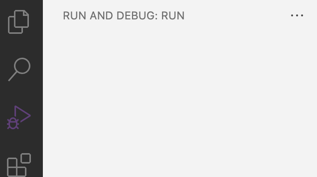

   </details>

1. Use the **Ports** tab to find the webpage address, open it, and verify it is running.

   <details>
   <summary>📸 Show screenshot</summary><br/>

   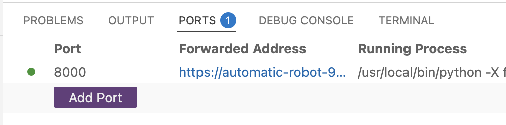

   </details>

</details>

## ⌨️ Activity: Enable Copilot cloud agent on your repository

Before we can start giving requests from teachers to Copilot, we need to grant access to our repository.

1. In the top right, click your **user icon** and select **Settings**.

   <br/>
   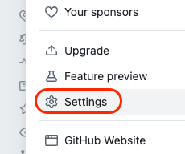

1. In the left navigation, expand the **Copilot** section and select **Cloud agent**.

   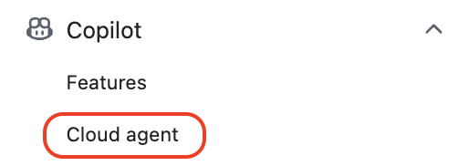

1. Check that the **Repository access** field is set to `All repositories`.

   Alternatively, if you prefer to enable it for only this exercise, select `Only selected repositories` and select this exercise repository (`{{ full_repo_name }}`).

   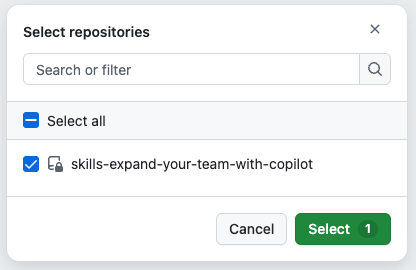

## ⌨️ Activity: Assign Copilot an issue

The teachers have already created several important issues, but let's do a test run of something simple first. This will let us see how task management with Copilot might work, so we can make guidelines for the other teachers. Most don't know how to use a traditional coding editor!

> [!TIP]
> Try to make an issue's goal and acceptance criteria clear. Also, breaking down large tasks into shorter ones provides more opportunity for feedback!

1. Go to the **Issues** tab of this exercise repository and click the **New Issue** button.

1. Set the **Title** to:

   ```md
   Missing Activity: Manga Maniacs
   ```

   Enter the below text as description, and click the **Create** button.

   ```md
   The manga club was recently announced and is naturally missing from the website. Please add it.

   Here are the details:

   Description: Explore the fantastic stories of the most interesting characters from Japanese Manga (graphic novels).

   Schedule: Tuesdays at 7pm
   Max attendance: 15 people
   ```

1. In the top right, click on the **Assignees** area and select **Copilot**.

   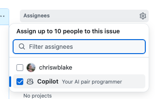

1. A dialog **might** appear describing that Copilot will begin work. Click the **Assign** button, ignoring the option to provide additional details.

   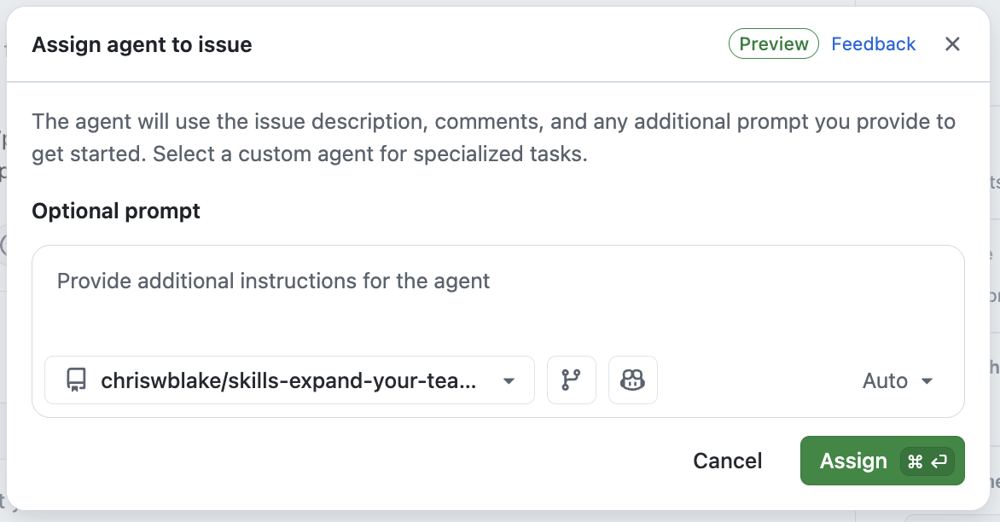

1. After you assign the issue to Copilot, in a moment, you will notice:
   - The issue will have an `👀` reaction to show Copilot is reading the issue.
   - The activity log shows you assigned the issue to Copilot.
   - The issue log includes a linked pull request.

   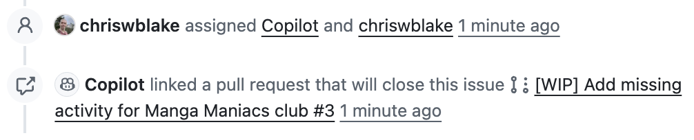

1. With the issue assigned, Mona should be busy checking your work. Give her a moment to share the next steps.

<details>
   <summary>Having trouble? 🤷</summary><br/>

If you don't get feedback, here are some things to check:

- Make sure you assigned the correct issue. If you practice on other issues, they will be ignored.

</details>
