## Step 2: Collaborate with Copilot

Now that you've assigned Copilot to your Issue, you can see Copilot also started a Pull Request and linked it to your issue!

Let's learn how to review Copilot's work and provide feedback, just like you would with any team member.

### 📖 Theory: Understanding Copilot's collaboration workflow

Copilot provides transparency into its work through multiple channels on the pull request. Let's look into those!

#### 📝 Pull request description

The description will be continuously updated as Copilot progresses through its work. You can watch the description update in real time!

#### 🤖 Cloud Agent Sessions

Copilot does all work inside **sessions**. Each time you assign a task, it analyzes the problem, plans its approach, and implements changes. The first session is started immediately when Cloud Agent gets assigned.

In the pull request timeline, you will be able to see progress indicators showing when Copilot starts and completes work

You can access the session logs in two ways:

- **🔴 Live**: Watch the logs in real-time to see all the steps and logic Copilot cloud agent session is taking to solve the task
- **📋 Review**: View the session logs after Copilot has completed its work to review the decisions made

<details>
<summary>📸 Copilot Session Logs </summary><br/>

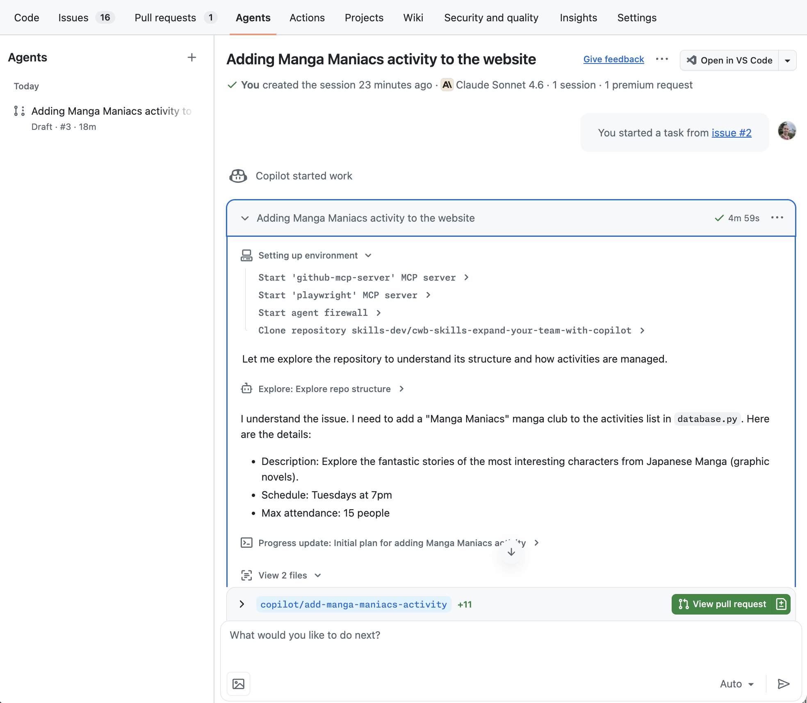

</details>

#### 💬 Providing feedback to Copilot

Once Copilot completes its work, you can collaborate with it just like any team member. The key to effective collaboration is understanding how to trigger new sessions:

Copilot will only act on comments or pull request reviews when they include a `@copilot` mention.

This means you can also leave regular comments for your other (human) team members and Copilot won't start unnecessary sessions!

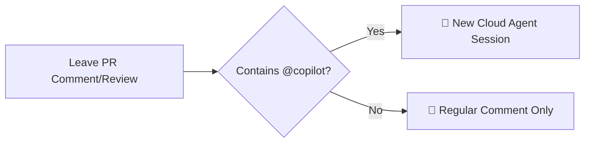

#### ⚙️ Important considerations

- Copilot's work is done on a branch with the convention `copilot/*` and does not have access to other branches
- By default, Copilot does not trigger Actions workflows. Unless enabled in the repository settings, workflows triggered on pull requests require human approval before running.
- Rulesets and similar protections are still enforced.

> [!TIP]
> All work created by Copilot is committed with the assignee as a co-contributor (keeping your contribution graph safe). 💕

### ⌨️ Activity: View Copilot's progress

1. Navigate to the **Pull Request** that Copilot referenced in your issue.

1. Watch in real-time as Copilot updates the pull request description. It will progress through 3 phases:

   <details>
      <summary>1. When starting, Copilot provides an initial copy of the issue. <b>[show image]</b></summary>
      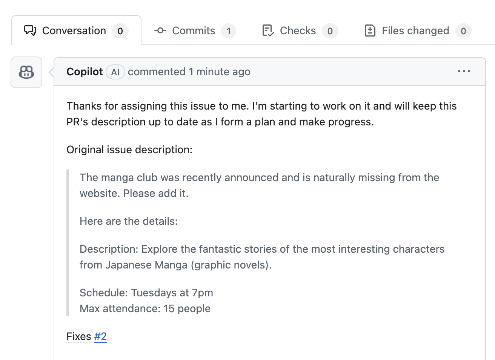
   </details>

   <details>
      <summary>2. After planning, Copilot provides a set of action items. <b>[show image]</b></summary>
      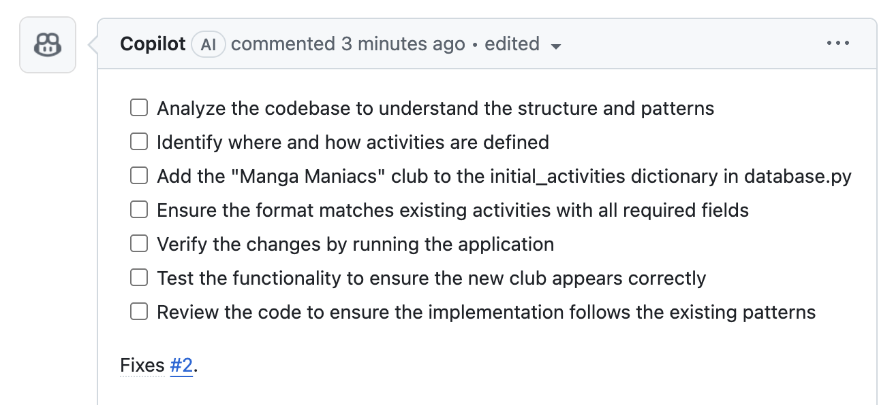
   </details>

   <details>
      <summary>3. After finishing, Copilot provides a summary. <b>[show image]</b></summary>
      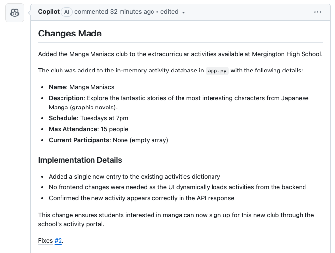
   </details>

1. Scroll down slightly to view the timeline and high-level notes provided by Copilot. Click the **View session** button.

   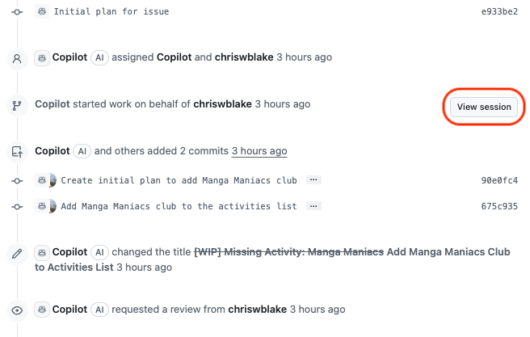

1. The new page shows a journal of Copilot's work. On the left side, you can see a list of sessions.

   

1. If the Copilot session is still ongoing, monitor the session journal.

   > 🪧 **Note:** Sometimes this can take a while. You will see in the step 3 how to help Copilot with common setup issues.

1. When Copilot completes its work and requests you as a reviewer of the pull request, you can proceed to the next activity!

> [!TIP]
> In the Pull Request description, you can use the **edited** dropdown to view the description history.
>
> <details>
> <summary>Show image</summary>
> 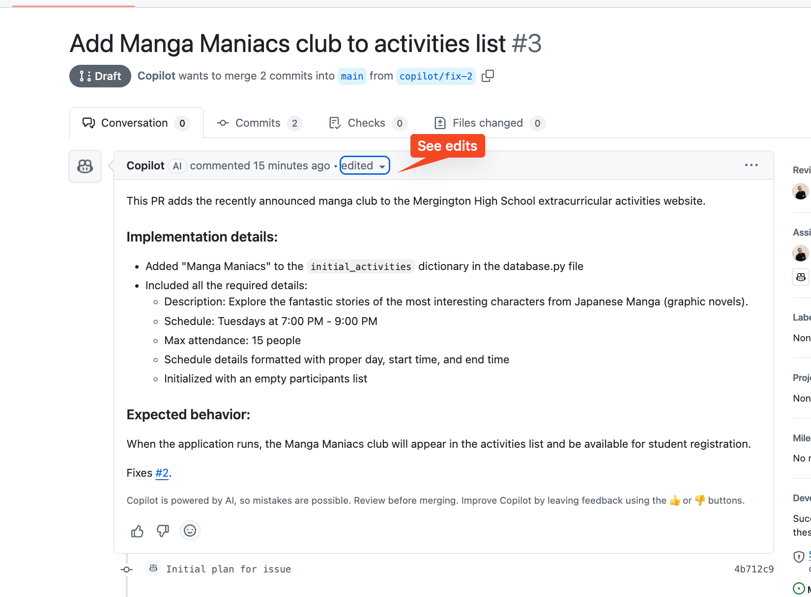
> </details>

### ⌨️ Activity: Provide Copilot feedback

Now that Copilot has finished its working session, let's review its work and provide some feedback!

1. In the pull request, click the **Add your review** button.

   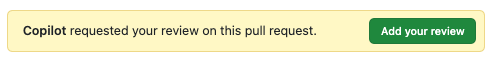

1. Find the new entry created by Copilot. Hover over a line to show the plus sign. **Click** to open the add comment dialog box.

   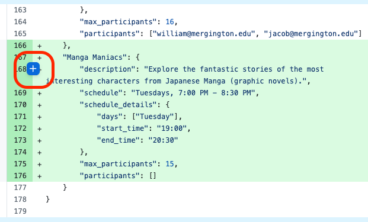

1. Reading the description, we think it should be more interesting to match the Manga spirit. Let's ask Copilot to fix that. Enter the following text and click **Start a review**.

   ```md
   @copilot Please change this description to be inspired by Japanese Manga.
   It needs more personality to attract students.
   ```

1. Above the changes list, click the **Submit review** button to open the review panel. At the bottom of the panel, select **Submit Review**.

   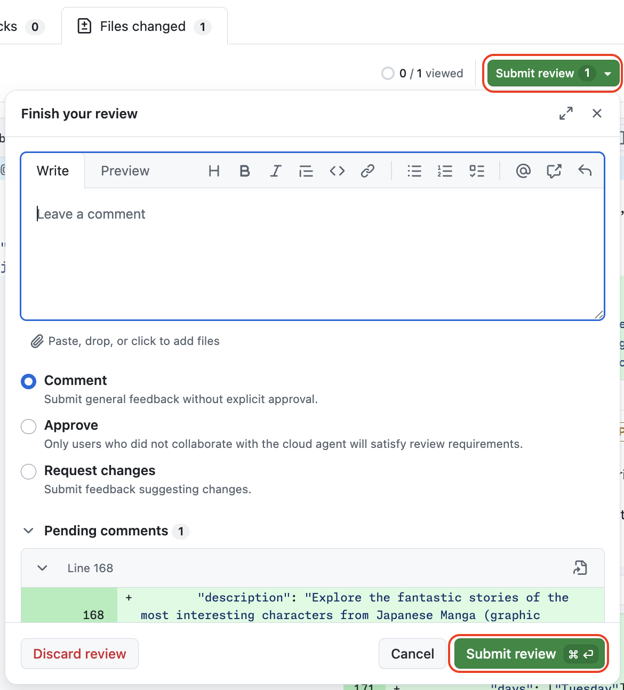

1. After a moment, Copilot will start working on your requested changes in a new agent session. Click the new **View session** button that will appear in the pull request timeline.

   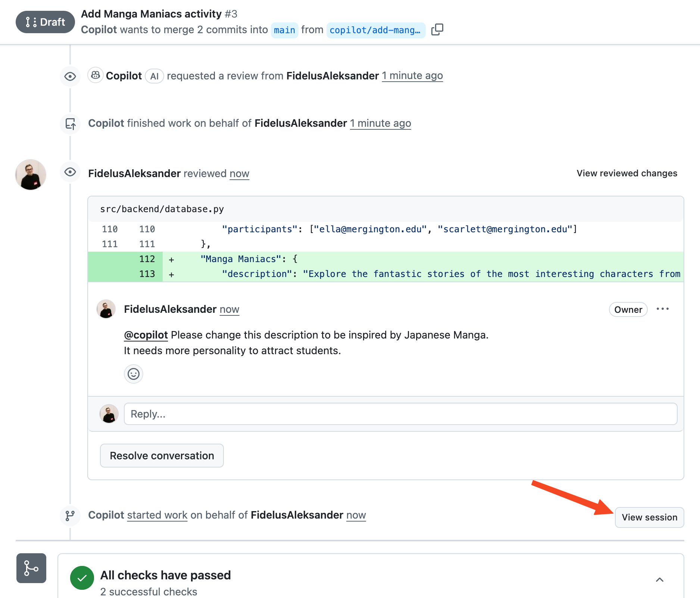

1. As you can see, Copilot started working on the requested changes in a new session. However, the entire session journal is kept here so you can revisit logs from the previous sessions!

   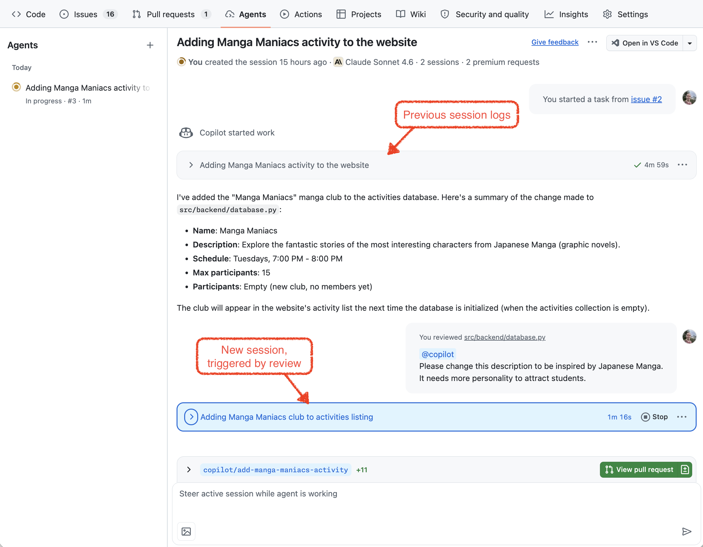

1. You can also steer Copilot mid session if you have any extra details you forgot to add initially, or you notice Copilot is heading in the wrong direction.

   > 🪧 **Note:** This step is optional - if the cloud agent session for the requested changes is already finished, don't worry - you can skip this step!

   Using the bottom chat panel, right below the session logs - provide this new information that just came up!

   ```md
   There is a slight change of plans. We have a higher enrollment for this class.

   Let's move the schedule to 5PM tuesday and change the maximum allowed participants to 25.
   ```

1. Wait for Copilot to finish working on the changes.

   > 🪧 **Note:** This can take some time! You can monitor the new session or take a break.

1. Once Copilot is finished, you will get requested as a reviewer again.

1. Return to the Pull Request **Conversation** tab. At the bottom, click the **Ready to Review** button, then the **Merge pull request** button, and confirm.

1. With the pull request merged, Mona should be checking our work. Give her a moment to respond with the next lesson.

<details>
<summary>Having trouble? 🤷</summary><br/>

If you don't get feedback, here are some things to check:

- Make sure your reviews include `@copilot` mention
- To progress to the next step in this lab you need to merge the pull request!

</details>
