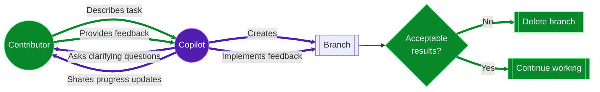
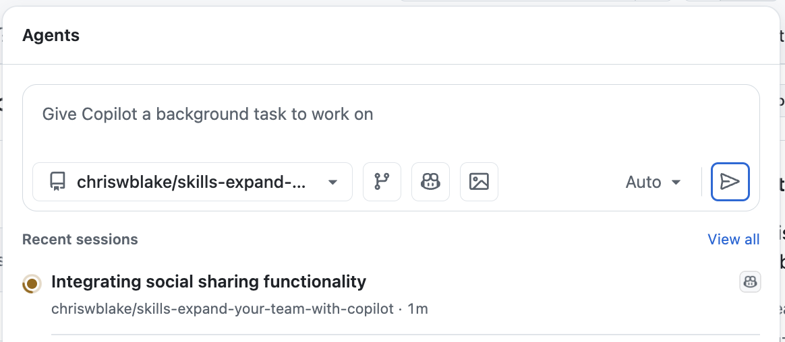
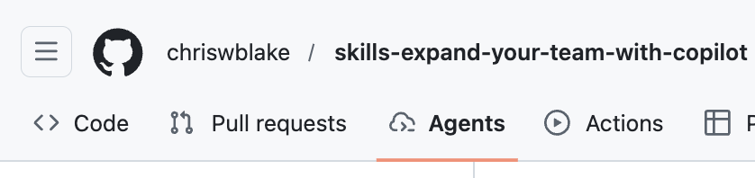
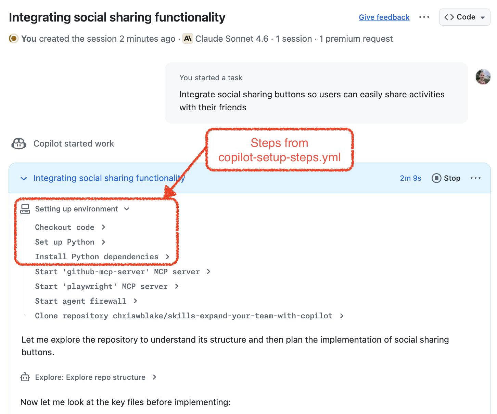

## Step 4: Manage multiple tasks with Agents Tab and Panel

Now, with Copilot's workspace prepared and more efficient, let's try jumping straight into assigning tasks to make the Extra curricular Activities website even more amazing! ✨🚀

Until now, we've been teaming up with Copilot by assigning issues one at a time. 📝🤝

But what if you could skip the extra steps and jump straight into task mode? What if Copilot could juggle several jobs at once, keeping you in the loop as they progress? 🤹‍♂️

Let's see how that's done! 👀

### 📖 Theory: Delegate in the repository with the Agents Tab

Every repository has a dedicated area for managing tasks assigned to Agents. This area provides a more direct approach to assigning work, that allows you to get started working immediately. No issue or pull request required! A common flow might look like this:

1. A contributor with **write access** navigates to the Agents tab on the repository.
2. The contributor describes a task, or works with Copilot to plan the task.
3. Copilot reviews the task and collects feedback as needed.
4. Copilot works on a branch in an Actions workflow and provides updates via the session page's conversation interface.
5. When Copilot finishes the task, the contributor has the option to continue prompting for more changes, building on the same branch.
6. The contributor decides how to handle the resulting branch, for example deleting it, adding manual changes, creating a pull request, merging the results to a local branch (without a pull request), etc.



> [!TIP]
> If you know you will keep the work, you can also ask Copilot to start the pull request in your initial task description.

### 📖 Theory: Delegate from anywhere with Agents Panel

The agents panel is your mission control center for agentic workflows across **multiple repositories**. It’s a lightweight overlay that allows you to give new tasks to Copilot and track existing tasks without navigating away from your current work.

From the agents panel, you can:

- 🛠️ Assign background tasks without switching pages.
- 👀 Monitor running tasks with real-time status.
- 🔗 Jump to the related repository, session logs, and pull request.

With the Agents panel, you can quickly assign multiple tasks issues, track their progress, and review results — all in one place.

   <!-- image source: https://github.blog/news-insights/product-news/agents-panel-launch-copilot-coding-agent-tasks-anywhere-on-github/ -->

   

### ⌨️ Activity: Assign tasks through the Agents Panel

> [!IMPORTANT]
> Make sure you merged the `prepare-environment` branch from the previous step before proceeding.

Let's get you familiarized with the Agents panel! This is always available so it is a great way to assign an idea to Copilot, regardless of what project you are currently on.

1. In a new tab, open the **Copilot Agents** panel from the top navigation bar

   

1. Make sure the `{{ full_repo_name }}` repository is selected in the panel and the branch is set to `main`.

1. Insert the following task description and submit it. Copilot will start a branch and begin working, without creating a pull request.

   

   ```prompt
   Integrate social sharing buttons so
   users can easily share activities with their friends
   ```

   > 💡 **Tip:** Since no pull request is created, this is a great way to experiment and be creative, without adding noise to your pull request history. If you don't like the results, just delete the branch!

1. After a moment, you will notice that the task appears in the panel with its current status. You can check back here for a high level overview of all your assigned tasks.

   

1. Click on the task to jump straight to the related repository's **Agents** tab and session logs, to track how Copilot is working on it in real time.

1. You will notice Copilot begins by running the customization steps you've set up in the previous step!

   

   

1. Let's leave Copilot to work its magic for now, you can come back to review the results later and optionally create a pull request. ✨

   

> [!TIP]
> You can also access the Agents Panel in full screen mode at https://github.com/copilot/agents

### ⌨️ Activity: Try implementing 2 issues simultaneously

You still have some issues opened on the repository, let's see how Copilot can handle working on multiple issues at the same time!

1. In the top navigation, select the **Issues** tab.

1. Find the following 2 issues and open each in a new tab.
   - `Difficulty Tracks`
   - `Dark Mode`

1. With both tabs open, assign both to Copilot simultaneously.

1. Open the **Copilot Agents** panel again and notice that the issues you assign also appear here!

   

1. For both tasks, monitor the progress in separate browser tabs. Remember, since these were created from issues, you can also track them from the **Pull Requests** tab.

   > 💡 **Tip:** You can also check the status of the task you assigned in the previous activity. Maybe Copilot is done by now?

1. When Copilot is finished on any of the tasks, review the PR description, the changes made and merge the pull request!

1. With at least 1 pull request merged, Mona should be checking your work and preparing your final review.

> [!IMPORTANT]
> Working on multiple issues in parallel is an art-form. 🎨
> Make sure you keep them independent to avoid merge conflicts! 😱
